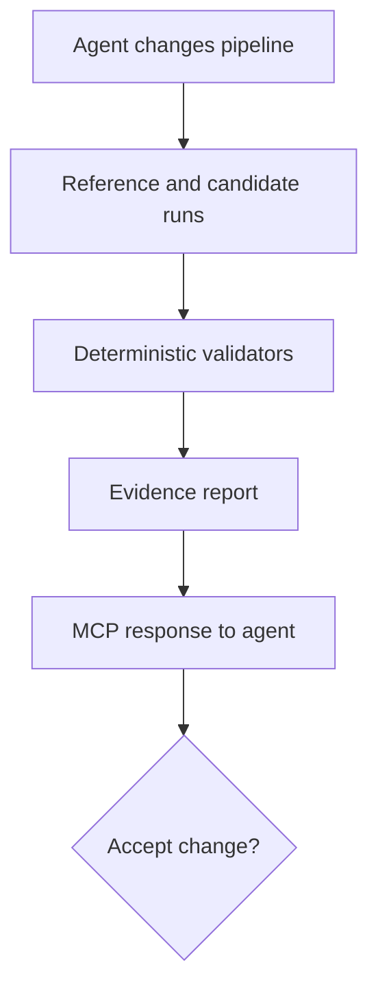

# Proofline MCP

[](https://github.com/Abhishek249/proofline-mcp/actions/workflows/ci.yml)

**A validation control plane for data pipelines written by AI agents.**

Coding agents can now generate an ingestion or transformation pipeline in minutes. The harder
question is whether the generated pipeline silently changed the data. Proofline runs a candidate
implementation against a trusted reference, executes deterministic invariants, and returns a
machine-readable evidence report through the Model Context Protocol (MCP).

This repository is a working vertical slice built around NYC taxi-shaped trip data. It includes a
deterministic local fixture, four realistic defect classes, five validation checks, and an MCP tool
an agent can invoke before accepting its own pipeline change.

## Why this matters

Traditional data-quality tests ask whether one dataset satisfies fixed rules. Proofline asks a
different question: **is the agent's new implementation behaviorally equivalent to the trusted
pipeline, and what evidence supports that conclusion?**

| Injected defect | Evidence that exposes it |
|---|---|
| Duplicate records | row-count drift and duplicate keys |
| Missing daily partition | missing keys and aggregate drift |
| Timezone conversion error | pickup-hour distribution drift |
| Incorrect zone mapping | per-zone fare aggregate drift |

## Quick start

Requires Python 3.11+.

```bash
python -m venv .venv
source .venv/bin/activate
pip install -e ".[dev]"
pytest
```

Run a clean candidate:

```bash
proofline --rows 1000
```

Inject a defect and inspect the evidence:

```bash
proofline --fault missing_partition --fault duplicate_rows
```

Run the MCP server over stdio:

```bash
proofline-mcp
```

The server exposes `validate_candidate_pipeline`, with `faults`, `row_count`, and `seed` as inputs.
For example, an MCP client can request validation with `faults=["timezone_shift"]` and receive the
overall decision, every check, expected and actual values, and focused failure evidence.

## Architecture



The MVP deliberately keeps orchestration separate from validation logic:

- `fixtures.py` creates reproducible taxi-shaped source records.
- `pipelines.py` contains the reference, candidate, and controlled defect injection.
- `validators.py` produces evidence-bearing check results.
- `runner.py` creates stable run identities and the final report.
- `server.py` exposes the capability through MCP.

## Research direction

Proofline is designed to grow into a benchmark for **agent-generated data pipeline reliability**.
A publishable evaluation would give coding agents transformation tasks, inject or observe defect
classes, and measure detection recall, false-positive rate, time-to-diagnosis, and evidence quality
across validation strategies.

The next milestone replaces the synthetic fixture with public NYC Taxi & Limousine Commission
Parquet files, adds DuckDB-based candidate implementations, and stores signed provenance for every
artifact. The synthetic mode remains important: it makes CI deterministic and provides known
ground truth for each defect.

## Roadmap

- [x] Reproducible reference and candidate pipelines
- [x] Controlled fault injection and evidence-rich checks
- [x] MCP server, CLI, tests, Docker image, and CI
- [ ] NYC TLC Parquet adapter and schema contracts
- [ ] Agent task corpus and benchmark harness
- [ ] OpenTelemetry traces and signed evidence bundles
- [ ] Kubernetes deployment and policy-gated pull-request integration
- [ ] Empirical study and research paper

## Project status

Proofline is an early research prototype. It should not yet be used as a production quality gate.
Contributions and benchmark defect cases are welcome.
