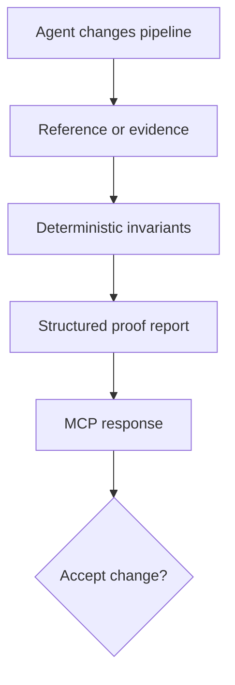

<p align="center">
  
</p>

<p align="center">
  <strong>Evidence-based validation for data pipelines built by AI agents.</strong>
</p>

<p align="center">
  <a href="https://github.com/Abhishek249/proofline-mcp/actions/workflows/ci.yml"></a>
  <a href="LICENSE"></a>
  
</p>

## 1. What is Proofline MCP?

Proofline is an open-source **validation control plane for agentic data pipelines**. It gives coding
agents and AI-assisted engineering workflows an MCP tool that answers a question conventional job
status cannot:

> The pipeline job says “success”—but did the correct data actually land in the correct place?

Proofline compares observed pipeline behavior with deterministic invariants or a trusted reference
and returns a structured evidence report: pass/fail, expected value, actual value, and diagnostic
context. An agent can call it before accepting a generated pipeline change, approving a deployment,
or reporting that a run is healthy.

The server currently exposes two tools:

| MCP tool | Purpose |
|---|---|
| `validate_candidate_pipeline` | Reproducible reference-versus-candidate validation using the public taxi-shaped benchmark |
| `validate_geospatial_run` | Domain-neutral semantic checks from orchestrator, worker, database, and spatial evidence |

## 2. Why does it exist?

AI coding agents can generate ingestion and transformation code quickly, but a syntactically valid
change is not necessarily a semantically correct pipeline. Unit tests and orchestration status cover
only part of the failure surface.

Proofline targets the **semantic correctness gap** in agentic data engineering:

- **Silent-success failures:** the orchestrator is green while an expected row, partition, polygon,
  or aggregate was never produced.
- **Schema and data-contract drift:** a generated transformation changes keys, cardinality, types,
  partitions, or null behavior without crashing.
- **Behavioral regression:** candidate output differs from a golden dataset or last-known-good
  implementation even though both jobs complete.
- **Distributional drift:** time buckets, geospatial areas, aggregates, and other population-level
  signals shift because of timezone, mapping, filtering, or join defects.
- **Weak agent feedback loops:** coding agents see logs and exit codes, but lack deterministic,
  machine-readable evidence explaining what invariant failed.
- **Fragmented observability:** orchestration metadata, worker status, database state, and output
  quality are checked independently instead of as one cross-system assertion.
- **Unverifiable AI-generated changes:** an agent proposes code without attaching a reproducible
  evaluation record that a human or another agent can audit.

In AI-platform terms, Proofline acts as an **eval and guardrail at the data-pipeline boundary**. MCP
makes that eval callable by any compatible agent, while deterministic checks keep the final decision
outside the language model. Proofline complements logs, traces, unit tests, and data observability;
it does not replace them.

## 3. How does it work?



1. The agent or automation supplies candidate output or an evidence envelope.
2. Proofline evaluates exact invariants: row counts, key sets, uniqueness, aggregates,
   distributions, write completion, shape presence, session parity, area drift, or Jaccard.
3. Each check records its expectation, observed value, status, and focused evidence.
4. The MCP tool returns an overall decision plus every individual check.
5. The caller can block acceptance on `status: "fail"` and use the evidence to diagnose or repair
   the pipeline.

Proofline's decision path is deterministic: the LLM chooses when to call the tool, but it does not
decide whether a violated invariant passes.

### Live product demo

<p align="center">
  <a href="assets/proofline-demo.mp4">
    
  </a>
</p>

<p align="center">
  <a href="assets/proofline-demo.mp4">Watch the MP4 version</a>
</p>

The repository includes a real MCP demo client and a reproducible VHS recording specification.
First verify the interaction directly:

```bash
python scripts/demo_live.py
```

The product video is a one-time documentation artifact, not a CI job. To record it locally, install
[VHS](https://github.com/charmbracelet/vhs) and FFmpeg, then run this command from the repository
root:

```bash
vhs demo/proofline.tape
```

This records the real MCP stdio interaction as `assets/proofline-demo.gif`. The checked-in MP4 is
derived from that recording with FFmpeg. Normal GitHub Actions remain dedicated to tests and
benchmarks.

## 4. Setup instructions

Requires Python 3.11 or newer.

```bash
git clone https://github.com/Abhishek249/proofline-mcp.git
cd proofline-mcp

python -m venv .venv
source .venv/bin/activate
pip install -e ".[dev]"

ruff check .
pytest
```

Run the local MCP server over stdio:

```bash
proofline-mcp
```

Example Cursor-compatible MCP configuration:

```json
{
  "mcpServers": {
    "proofline": {
      "command": "/absolute/path/proofline-mcp/.venv/bin/proofline-mcp"
    }
  }
}
```

Restart the MCP client after changing its configuration. It should discover
`validate_candidate_pipeline` and `validate_geospatial_run`.

Run the public proof and benchmark:

```bash
python scripts/prove_it.py
python scripts/benchmark_mcp.py --output benchmark-report.json
```

Docker users can build the stdio server with:

```bash
docker build -t proofline-mcp .
docker run --rm -i proofline-mcp
```

## 5. Results on NYC taxi-shaped trip data

The public benchmark generates deterministic taxi-shaped trips, executes a trusted reference and a
candidate pipeline, and injects four known defect classes across four seeds and two dataset sizes.
Every trial crosses a real MCP stdio client/server boundary.

[View the successful GitHub Actions run](https://github.com/Abhishek249/proofline-mcp/actions/runs/34443656200)
· [Read the permanent benchmark record](docs/verified-benchmark-2026-09-10.md)

| Verified signal | Result |
|---|---:|
| Tests | 12 passed |
| Code coverage | 91% |
| MCP benchmark trials | 40 |
| Defect trials | 32 |
| Clean trials | 8 |
| Defects detected | 32/32 |
| Detection recall | 100% |
| False-positive rate | 0% |
| Required-diagnostic accuracy | 100% |
| MCP call latency | 3.213 ms p50 / 5.263 ms p95 |

| Injected defect | Required evidence | Outcome |
|---|---|---:|
| Duplicate records | Duplicate keys and row-count drift | Detected |
| Missing partition | Missing keys and aggregate drift | Detected |
| Timezone shift | Pickup-hour distribution drift | Detected |
| Wrong zone mapping | Per-zone fare aggregate drift | Detected |

These results establish reproducibility for Proofline's **published controlled fault model** on a
GitHub-hosted Ubuntu 24.04 runner with Python 3.12.14. They are not claims about arbitrary production
pipelines. Validation against external, real-world geospatial infrastructure is a separate milestone.

## Roadmap

- [x] Deterministic reference/candidate framework
- [x] Evidence-rich MCP tools
- [x] Controlled fault injection
- [x] Independent GitHub Actions proof and benchmark
- [x] Reusable geospatial evidence contract
- [ ] Real public NYC TLC Parquet adapter
- [ ] Pluggable PostgreSQL and orchestration adapters
- [ ] Signed evidence bundles and OpenTelemetry traces
- [ ] Policy-gated pull-request integration
- [ ] Empirical evaluation and research paper

Proofline is an early research prototype and is not yet a production quality gate. Contributions,
fault cases, and benchmark improvements are welcome.
